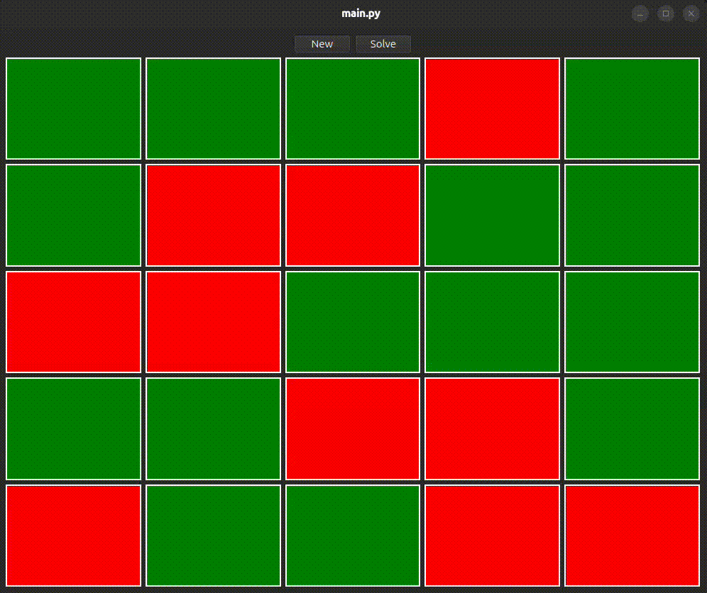

# Lights Out
---

## About 
---

Lights Out is an electronic puzzle game released by Tiger Electronics in 1995. The game starts with an N x N grid, usually 5x5, of lights in a randomly configured state: on or off. The goal is to turn off all the lights by pressing a sequence of lights that will toggle its direct neighbors. Interestingly, the board can be represented as a matrix, and with the help of some linear algebra we can solve directly for a solution to a given configuration. For those interested, a short explanation of the mathematics behind the solver can be found [here](/public/math.md).

The program simulates the game by creating a random, valid configuration. Additionally, there is a "solver" button that steps through the most efficient solution as well as a "new" button which refreshes the board with a new configuration. 

### Built With

* [![Python][Python-shield]][Python-url]
* [![PyQt6][PyQt6-shield]][PyQt6-url]
* 

## Demo
---



## Getting Started
---

### Prerequisites

This project was built with Python version 3.14.3. Please ensure that you use at least Python 3.14 for the program to be fully functional. Earlier versions have not been tested and are not guaranteed to work.
* Python/pip
  ```sh
  py -m pip install --upgrade pip
  ```

### Installation

1. Clone the repo
   ```sh
   git clone https://github.com/Implycitt/LightsOut.git

   cd LightsOut
   ```
2. Create a venv 
   ```sh
   python3 -m venv .venv

   source .venv/bin/activate
   ```
3. Install the packages
    ```
    pip install -r requirements.txt     
    ```
4. run the main .py file
    ```sh
    python src/main.py 
    ```

## Resources
---

* [Physics for the birds](https://www.youtube.com/watch?v=0fHkKcy0x_U) - original video inspiration 
* [MAA](https://people.sc.fsu.edu/~jburkardt/classes/imps_2017/11_28/2690705.pdf)
* [Madsen Lights Out](http://cau.ac.kr/~mhhgtx/courses/LinearAlgebra/references/MadsenLightsOut.pdf)
* [Wolfram Alpha Lights Out](https://mathworld.wolfram.com/LightsOutPuzzle.html)

## License
---

Distributed under the MIT license. See `LICENSE.txt` for more information.

[forks-shield]: https://img.shields.io/github/forks/Implycitt/LightsOn.svg?style=for-the-badge
[forks-url]: https://github.com/Implycitt/LightsOn/network/members
[stars-shield]: https://img.shields.io/github/stars/Implycitt/LightsOn.svg?style=for-the-badge
[stars-url]: https://github.com/Implycitt/LightsOn/stargazers
[issues-shield]: https://img.shields.io/github/issues/Implycitt/LightsOn.svg?style=for-the-badge
[issues-url]: https://github.com/Implycitt/LightsOn/issues
[license-shield]: https://img.shields.io/github/license/Implycitt/LightsOn.svg?style=for-the-badge
[license-url]: https://github.com/Implycitt/LightsOn/blob/master/LICENSE.txt
[Python-shield]: https://img.shields.io/badge/Python-0769AD?style=for-the-badge&logo=python&logoColor=yellow
[Python-url]: https://python.org 
[Pytorch-shield]: https://img.shields.io/badge/PyTorch-EE4C2C?style=for-the-badge&logo=pytorch&logoColor=white
[Pytorch-url]: https://pytorch.org 
[PyQt6-shield]: https://img.shields.io/badge/PyQt6-FFD43B?style=for-the-badge&logo=Python&logoColor=blue
[PyQt6-url]: https://pypi.org/project/PyQt6/
